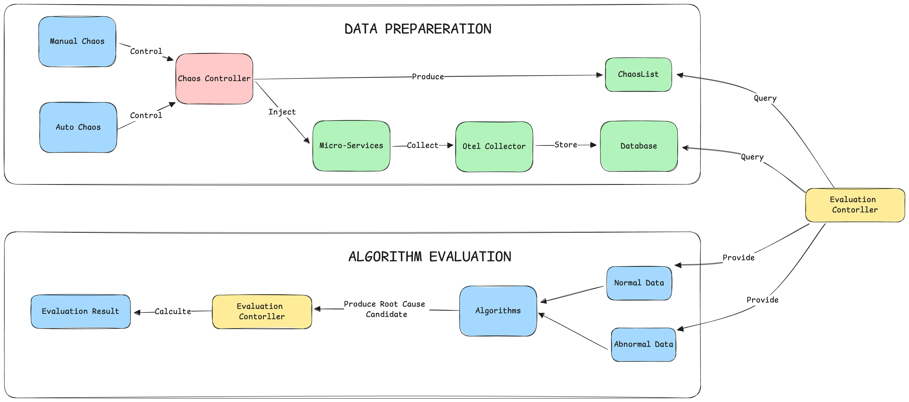
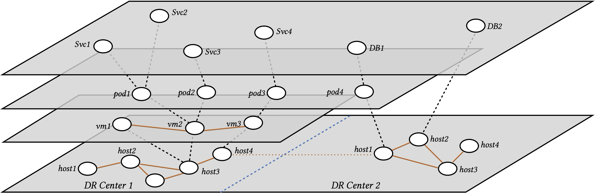
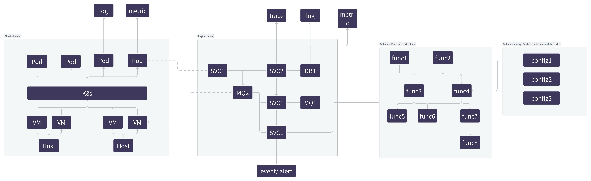

# 设计文档

根据[需求文档](./requirements_zh.md)，我们在此提出 RCABench 的设计文档。

整个 RCABench 的流程如下：

1. 故障注入：Chaos Controller 负责管理故障注入方面的内容。用户可以选择手动注入故障，也可以选择开启自动化地故障注入。
    - Chaos Contorller 随即会把故障按照要求注入到对应的服务当中。
    - Chaos Controller 还需要维护现有（历史）故障列表，包括故障发生的时间点（时间段）、故障类型、故障发生的位置，以供后续查询。
2. 数据采集：使用 Opentelemtry Protocol 作为数据交换协议。因为 Otel Protocol 是目前来说使用最为广泛的数据协议，支持多类平台、多种交换数据。采集到的数据通过 Otel Collector 的插件存储到对应的数据库中。
3. 算法评估控制器：当触发算法评估时，Evaluation Controller 会自动地去查询 ChaosList，以获取正常和异常时间段，从而去数据库里查询对应的数据。并且将数据发送给算法。在算法输出结果后，Evaluation Controller 自动计算算法的各项指标，最后将结果保存为文件。

## 流程通信规范

### 服务部署结构图

为了评估根因定位是否准确，首先需要对目标服务进行建模。在现代的部署架构中，往往是一个多层级的服务部署图。即：从最底层的数据中心开始，有大量的 Host 用于虚拟化，提供一系列的 Virtual Machine。Virtual Machine 上可能又会增加一层 Kubernetes 之类的调度器，用于调度不同 VM、不同 Host、不同 Data Center 的资源。最后在最上层，以 Pod、Service 的形式来对业务应用提供服务。另外，host 也可以直接向业务层提供服务。

在这样的一个复杂环境中，本规范拟采用一个图结构来描述这类部署结构图。具体而言：

1. 节点为各类资源节点和业务节点。例如 Host、VM、Pod。业务节点包括 Svc1、Svc2 等。其中需要区分出该节点为物理（实际存在的）节点，还是逻辑节点。例如：虚拟机可以被从 Host1 迁移到 Host2，那么它的物理关系发生了变化，但是逻辑上的关系（对上提供的服务）没有发生变化；再例如，业务节点依赖的 Pod 发生了调度、重启，那么 Pod 的物理关系发生了变化，但是与业务的逻辑关系并没有发生变化。
2. 节点之间的边表示节点之间的依赖（部署）关系，包括物理关系和逻辑关系。

根据这个思路，我们进一步将结构图扩展到带有观测数据的一个图。不同的观测数据可以被关联到对应的逻辑节点或者是物理节点，同时为他们新增一个新的类型的边。

 

其中，所有的节点都应当具备一个 id，用于标识其唯一性。另外，由于服务的动态性，应当能够标识其逻辑关系与物理关系的变化。例如某逻辑 id 随着时间的物理 id 的变化。

### 故障注入列表接口定义

在注入故障时，需要选择故障注入的位置。注入的位置即服务部署结构图中的一个节点。例如向某个 Pod 注入 CPU 故障，那么与之关联的 node id 就是 root cause。

故障注入的列表应该包含：

1. 故障时间段，从故障开始时间到结束时间。
2. 故障类型。
3. 故障注入节点 id。

### 评估方案设计

在这个故障注入模式下，注入的粒度更细。而大部分算法的输出仅仅是输出某个逻辑节点，或者是某个物理节点。因此，在这种情况下，如果注入到的是物理节点，而逻辑节点包含了物理节点。那么应该被判定为正确。

